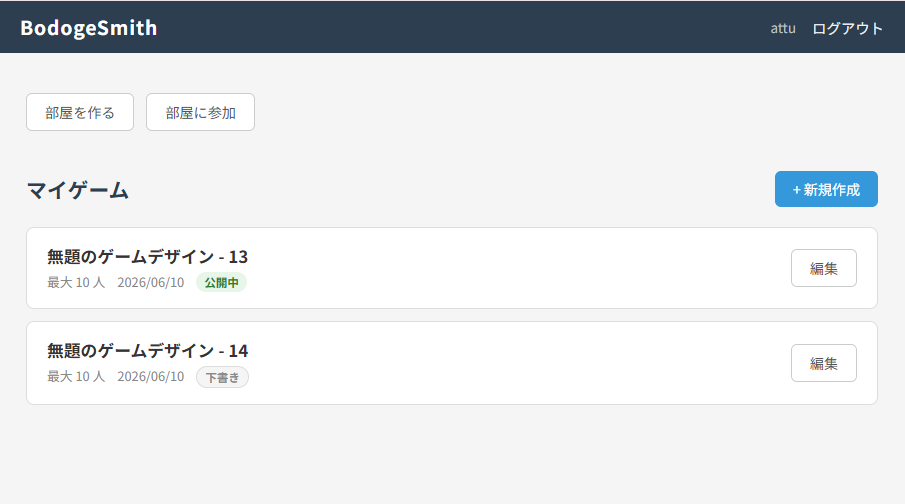
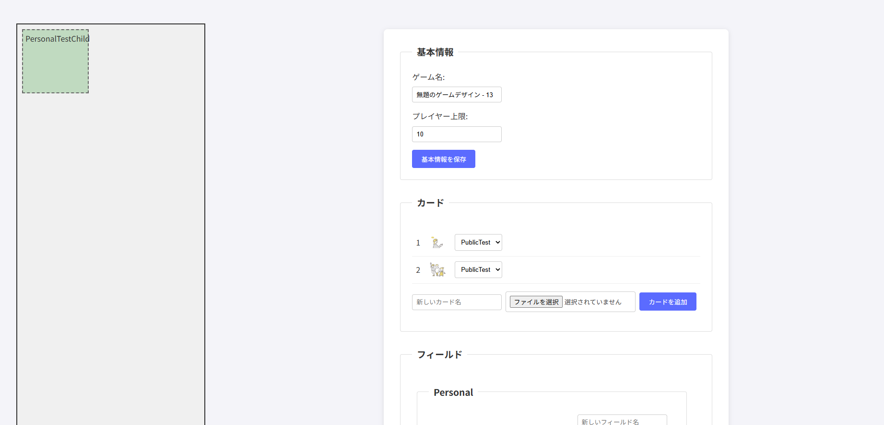
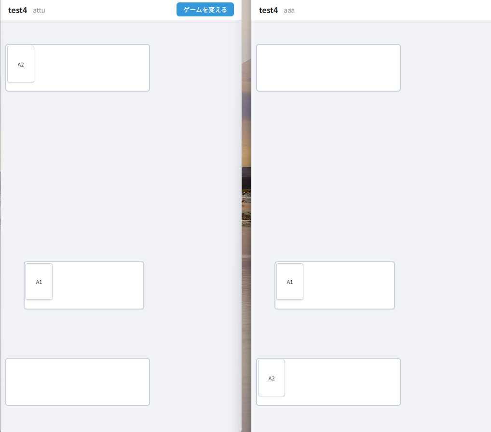
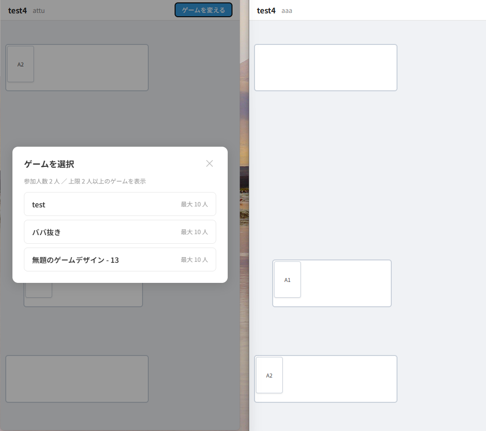

# BodogeSmith

**任意のカードゲームを設計・プレイできる汎用リアルタイムマルチプレイヤーフレームワーク**

ゲームデザイナーがブラウザ上でフィールドとカードを設計し、複数人でリアルタイムにプレイできるWebアプリケーションです。UNO・トランプ・オリジナルカードゲームなど、任意のルールをフレームワーク上に載せて遊ぶことを目指しています。




---

## 遊び方

### 1. ゲームを設計する（ゲームデザイナー）

1. ログイン後、「ゲームを作成」からゲームデザイン編集画面に入る
2. フィールドを追加する
   - **パブリックフィールド**：全員が共有する場所（デッキ・捨て札など）
   - **パーソナルフィールド**：プレイヤーごとの個別スペース（手札など）
3. ブラウザ上でフィールドの座標・サイズ・カード枚数上限などを設定する
4. カードを追加し、各カードの初期配置フィールドを指定する
5. 設計完了後「公開」にするとルームで選択できるようになる

### 2. 部屋を作ってゲームを始める

1. ホームから「部屋を作成」→ パスワードを設定
2. 他のプレイヤーに部屋名とパスワードを伝えて参加してもらう
3. 全員が集まったら部屋のオーナーが「部屋を締め切る」→ ゲームプレイ画面へ移動
4. ゲームマスター（部屋のオーナー）がゲームを選択してゲーム開始

### 3. プレイ

- カードをドラッグ＆ドロップでフィールド間を移動する
- **自分のスマートフォンが手札**のようなイメージ：各プレイヤーの画面は一人称視点で構成される
- 手札のカードは自分には表向き・相手には裏向きに見える（カードの visibility はプレイヤーごとに計算される）
- 操作はすべてWebSocketで全員にリアルタイム同期される




---

## 工夫した点・技術的こだわり

### 1. 三層 JSON 状態モデル（設計・配置・可視性の分離）

ゲーム状態を責務ごとに3つのJSONフィールドに分離しています。

| フィールド | 役割 |
|---|---|
| `_field_card_design_dict` | 各フィールドの**見た目**（座標・サイズ・枚数上限・反転設定） |
| `_field_cardInfo_dict` | 各フィールドに**どのカードがあるか**（実際の配置） |
| `_card_status_for_user_dict` | **各ユーザーから見た各カードの状態**（表/裏） |

「誰が見ているか」によってカードの見た目が変わる問題を、配置情報（全員共通）と可視状態（ユーザーごと）を別テーブルに持つことで解決しました。WebSocket でクライアントに送信する前にサーバー側で「このユーザーに何を見せるか」を計算して送り分けています。

### 2. Pydantic による Django JSONField の型安全化

Django の `JSONField` は任意の dict を受け入れるため、スキーマが崩れても実行時まで気づけません。Pydantic モデルをキャッシュレイヤーとして挟むことでこれを解決しました。

```
DB (JSONField) ← save → Python dict
                  ↑↓ parse_obj / model_validate
              Pydantic Model (型・バリデーション保証)
```

データを読み出すたびに Pydantic モデル経由でアクセスし、書き込み時はバリデーターが通過した値のみ保存されます。

### 3. 一人称視点の設計とプレイ時の自動変換

ゲームデザイン時はデザイナーの一人称視点（自分が南に座っている想定）でフィールドを配置します。プレイ時は各プレイヤーの視点に合わせてフィールドレイアウトを自動変換するため、デザイナーは「自分から見た配置」だけを考えればよい設計です。

### 4. 操作ログによる巻き戻し（Undo）

全カード操作を `[関数名, 引数, 実行ユーザー, 説明文, 日時]` の形式でログに保存しています。`rewind()` は直近の操作を逆順に適用することで状態を復元します。

### 5. WebSocket によるリアルタイム同期（Django Channels）

Django の同期 View に加え、Django Channels + Daphne で ASGI サーバーを構成しています。カードの移動・シャッフルなどすべての操作はサーバー経由でルームの全参加者に broadcast されます。

---

## 技術スタック

| 種別 | 技術 |
|------|------|
| バックエンド | Django 5.2.5 |
| WebSocket | Django Channels 4.3.1 / Daphne (ASGI) |
| データバリデーション | Pydantic v2 |
| フロントエンド | Vue 3 (CDN) / HTML / CSS |
| データベース（開発） | SQLite3 |
| データベース（本番） | PostgreSQL（Heroku） |
| 画像処理 | Pillow |

---

## データベース設計

```
GameDesign（ゲームテンプレート）
├── _field_card_design_dict   : JSONField  フィールドの見た目・設定
├── _init_field_cardInfo_dict : JSONField  カードの初期配置
├── _cards                    : M2M → Card
└── _player_limit             : int

Game（ゲームインスタンス）
├── _field_card_design_dict      : JSONField  フィールド設計のコピー
├── _field_cardInfo_dict         : JSONField  リアルタイムのカード配置
├── _card_status_for_user_dict   : JSONField  ユーザーごとのカード可視状態
├── _game_log                    : JSONField  操作履歴（巻き戻し用）
├── _players                     : M2M → User
└── _cards                       : M2M → Card

Card（カード）
├── _name  : str
└── _image : ImageField

Room（プレイルーム）
├── _game            : OneToOne → Game
├── _playing_members : M2M → User
├── _owner           : FK → User
├── _password        : 暗号化済
└── status           : OPEN / CLOSED
```

`GameDesign` がテンプレートで、ゲーム開始時に `Game` インスタンスとしてコピーされます。これにより、進行中のゲームに影響を与えずにテンプレートを編集できます。

---

## セットアップ

### 必要環境

- Python 3.11+

### インストール

```bash
python -m venv venv
venv\Scripts\activate      # Windows
# source venv/bin/activate  # Mac/Linux

pip install -r requirements.txt
python manage.py migrate

# WebSocket対応サーバーで起動
daphne -b 127.0.0.1 -p 8000 UNOpj.asgi:application
```

### 環境変数

`.env` ファイルをプロジェクトルートに作成してください。

```
SECRET_KEY=your-secret-key-here
```

アクセス: http://127.0.0.1:8000

---

## ディレクトリ構成

```
BodogeSmith/
├── UNOpj/           # プロジェクト設定（settings, urls, asgi）
├── account/         # ユーザー認証
└── game_factory/    # メインアプリ
    ├── models/      # Game / GameDesign / Room / Card + Pydanticモデル群
    ├── consumers/   # WebSocketコンシューマー（待機室・プレイルーム）
    ├── templates/   # HTML（PC・モバイル対応）
    └── static/      # Vue.js + カスタムJS
```
